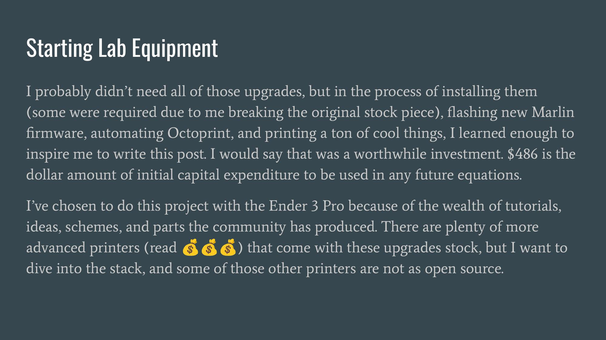
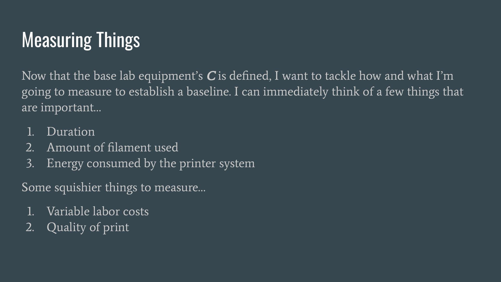
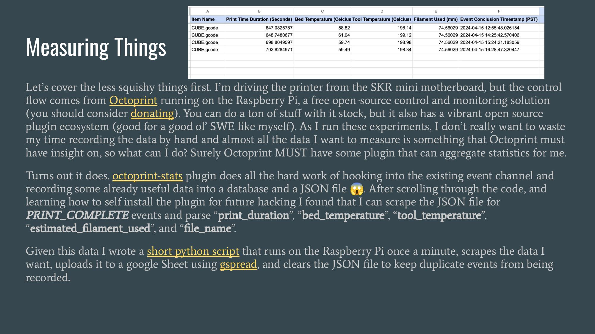
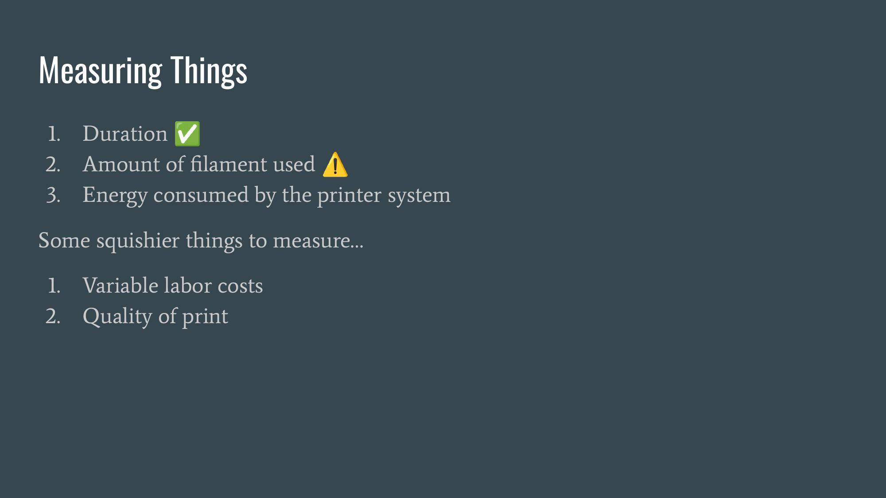
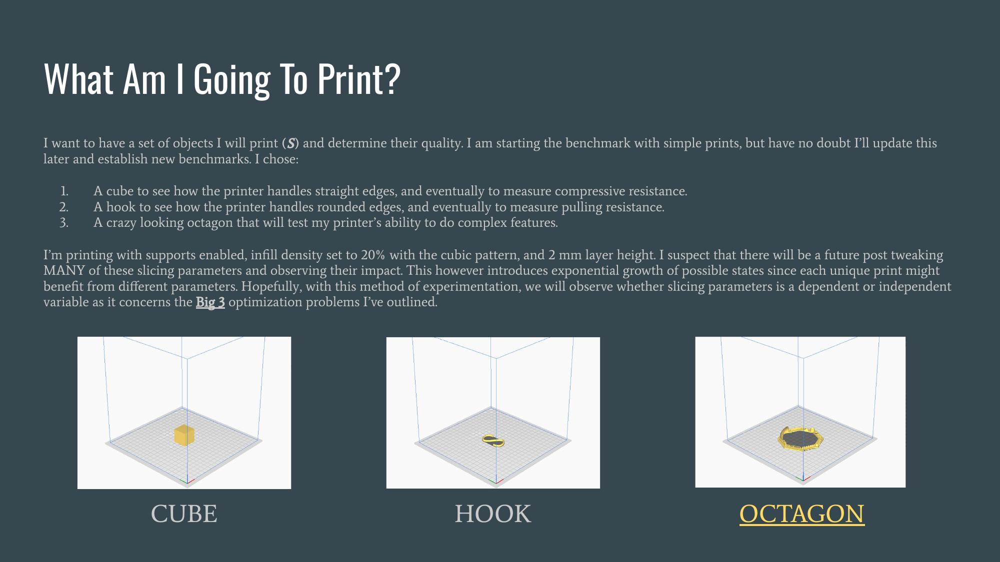

{:.ioda}

{:.ioda}

{:.ioda}

{:.ioda}

{:.ioda}

{:.ioda}

{:.ioda}

{:.ioda}

{:.ioda}

{:.ioda}

{:.ioda}

{:.ioda}

{:.ioda}

{:.ioda}

{:.ioda}

{:.ioda}

{:.ioda}

{:.ioda}

{:.ioda}

{:.ioda}

{:.ioda}

{:.ioda}

{:.ioda}

{:.ioda}

{:.ioda}

{:.ioda}

{:.ioda}

{:.ioda}

{:.ioda}

{:.ioda}

{:.ioda}
